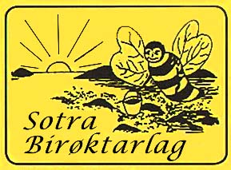

# Sotra Birøktarlag sin nettside


Dette er versjonskontrollversjonen av Sotra Birøktarlag sin hjemmeside. For å  se den faktisk hjemmesiden gå til [sotrabirøktarlag.no](https://sotrabirøktarlag.no)

## Nye innlegg
Bloggen er en Jekyll-blog og nye blogginnlegg må ha filnavn på formen`YEAR-MONTH-DAY-title.md`. Eksempelvis `2011-12-31-ett-nytt-ar.md`. 

Selve filen må starte med noe ala dette:
```
---
layout: post
title:  "Rapport fra Agdermøtet"
date:   2017-11-18
category: bier
excerpt : "Dette er et utdrag som vil vises på forsiden."
---
```
Og videre skrives på Markdown-formatet. Se her [Github Markdown syntaks](https://help.github.com/articles/basic-writing-and-formatting-syntax/) her mer informasjon om hvordan det gjøres.

For å se hvordan det kommer til å se ut kan man installere Markdownpad2 ( http://markdownpad.com/ ) og lime inn teksten din til venstre og så kan du se til høyre hvordan det vil bli seende ut.

Se mer her [Jekyll - posts](https://jekyllrb.com/docs/posts) for mer informasjon om Jekyll.


## Oppsett av Jekyll lokalt
Denne framgangsmåten krever linux(unbutu/debian) og ruby. Dette kan gjøres på windows og. Spør Fredrik om hvordan eller se [her](https://jekyllrb.com/docs/windows/)

- gem install jekyll bundler
- git pull git@github.com:SotraBiroktarlag/sotrabirokt.git
- cd sotrabirokt
- bundle install
- bundle exec jekyll serve
- Gå til http://127.0.0.1:4000 for å se